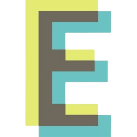

<br />

<div align="center">
  
</div>

<br />

### Proposta

<br />

<div>
  <p>
    construir uma aplicação web (frontend e backend) capaz de realizar a comunicação com APIs distintas, contendo um CRUD e um <a href="https://youtu.be/QgRchTndC4Q">vídeo explicativo</a>.
  </p>
</div>

<br/>

### Stack utilizada

<br />

<div>
  
    
  
  
  
  
</div>

<br />

## Instalação e uso

<br />

<div>
  <p>
    Baixe  o arquivo zip e extraia a pasta ou clone o repositório usando o seguinte comando no terminal:
  </p>

```bash
$ git clone https://github.com/Danilosrr/sharenergy-2023-01.git
```

  <p>
    Execute estes comandos em um terminal na pasta back-end:
  </p>

```bash
$ npm i
$ npm run prisma:deploy
$ npm run dev
```

  <p>
    Agora execute estes comandos em um terminal na pasta front-end
  </p>

```bash
$ npm i
$ npm run start
```

  <p>
    Pronto! você pode acessar a aplicação no link <a href="http://localhost:3000/">http://localhost:3000/</a></br>
    também é possível acessar uma documentação da API em <a href="http://localhost:3000/">http://localhost:4000/docs</a> 
  </p>

</div>
